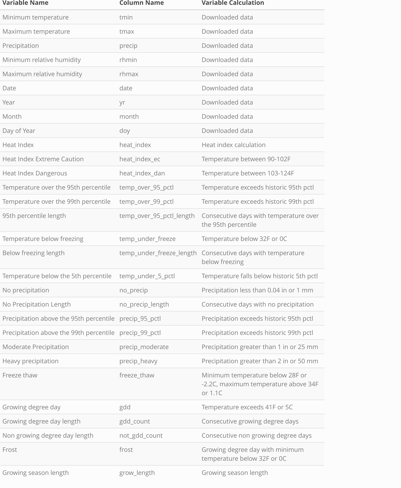

<!-- README.md is generated from README.Rmd. Please edit that file -->

```{r, include = FALSE}
knitr::opts_chunk$set(
  collapse = TRUE,
  comment = "#>",
  fig.path = "man/figures/README-",
  out.width = "100%"
)
```
<!-- badges: start -->
<!-- badges: end -->
# Reproducible Climate Futures (rcf)

## Overview

[Amber to fill in need for divergent, plausible, relevant CFs, with citation to Lawrence et al. for justification for this approach and methodology. Include brief description of 3 approaches for generating CFs and when they should be used.]

This package aims to make acquiring and working with CMIP5 [MACA v2-METDATA](http://www.climatologylab.org/maca.html) downscaled climate data faster and easier and to provide a number of summary statistics that can be used to visualize different climate futures. Ultimately, having access to this data supports planning efforts that aim to incorporate climate change.

## Installation

Until approval on CRAN, you should download the development version of `rcf`

You can install the released version of rcf from [CRAN](https://CRAN.R-project.org) with:

And the development version from [GitHub](https://github.com/) with:

``` r
# install.packages("devtools")
devtools::install_github("nationalparkservice/rcf")
```
<!-- Once CRAN is approved, provide instructions for installation from CRAN, for now commented out -->

<!-- ``` r -->
<!-- install.packages("rcf") -->
<!-- ``` -->


```{r}
library(tidyverse)
library(rcf)
```

## Usage
The first step in creating climate futures is downloading downscaled climate data for your location of interest. This package uses the [cft package](https://github.com/earthlab/cft), created by the North Central Climate Adaptation Science Center and EarthLab. Data can be downloaded from a specific point by inputing coordinates into the `rcf_data()` function. If you would like to download and summarize spatial explicit data (i.e. from multiple grid cells) or would like more information on the cft package, there is a detailed vignette on the project GitHub page. 

_Note: check for cft package updates periodically._

 Depending on internet connections and processing power, download time for a single grid cell averages about 80 minutes. The simplest and fastest method for generating climate futures is to download a single grid cell using the `rcf_data()` function.


```{r, eval=FALSE}
# raw_data <- rcf_data(SiteID = "BAND",
#                      latitude = 35.75758546,
#                      longitude = -106.3054344,
#                      units = "imperial")
```

Data used in this vignette can be downloaded [here](https://irmadev.nps.gov/DataStore/Reference/Profile/2286572) and read in using the following code:

```{r, eval=FALSE}
data_file_location <- "Directory where you stored data"
raw_data <- read.csv(paste0(raw_file_location,"/BAND.csv"))

```

```{r, include=FALSE}
raw_data <- read_csv(here::here("BAND.csv"))
```


Calculate threshold values using `calc_thresholds()` and summarize them by month, season or year as well as by quadrant or the most extreme model in each quadrant using `cf_quadrant()`.

```{r}
thresholds <- calc_thresholds("BAND", data = raw_data, units = "imperial")

quadrant_year <- cf_quadrant("BAND", data = thresholds, future_year = 2040, summarize_by = "year", method = "quadrant")
```

From here we can use `ggplot2` to visualize any variables and how they compare between the 4 climate futures as well as between past and future.

```{r, fig.width=15, fig.height=9, out.width="110%"}
quadrant_year_future <- quadrant_year %>%
filter(time %in% c("Future"))

ggplot(data = quadrant_year_future, aes(x = cf, y = freeze_thaw)) +
geom_boxplot(alpha = 0.4,
             aes(color = cf, fill = cf)) +
geom_jitter(alpha = 0.7,
            aes(color = cf, fill = cf)) +
scale_fill_viridis_d() +
scale_color_viridis_d() +
  labs(y = "Number of days per year",
       title = "Days that have a freeze thaw cycle by climate future") +
  theme(axis.title.x = element_blank()) +
  theme_minimal()
```


## Explore further

For a more in-depth explanation of the `rcf` package and different ways to download the data, you can follow along with An Introduction to the Reproducible Climate Futures package(INSERT LINK).

## Data

```{r, echo=FALSE, message=FALSE, warning=FALSE, results='asis', include=TRUE}
library(kableExtra)

names_table <- data.frame(name = c("Minimum temperature", "Maximum temperature", "Precipitation", "Minimum relative humidity", "Maximum relative humidity", "Date", "Year", "Month", "Day of Year", "Heat Index", "Heat Index Extreme Caution", "Heat Index Dangerous", "Temperature over the 95th percentile", "Temperature over the 99th percentile", "95th percentile length", "Temperature below freezing", "Below freezing length", "Temperature below the 5th percentile", "No precipitation", "No Precipitation Length", "Precipitation above the 95th percentile", "Precipitation above the 99th percentile", "Moderate Precipitation", "Heavy precipitation", "Freeze thaw", "Growing degree day", "Growing degree day length", "Non growing degree day length", "Frost", "Growing season length"), df_name = c("tmin", "tmax", "precip", "rhmin", "rhmax", "date", "yr", "month", "doy", "heat_index", "heat_index_ec", "heat_index_dan", "temp_over_95_pctl", "temp_over_99_pctl", "temp_over_95_pctl_length", "temp_under_freeze", "temp_under_freeze_length", "temp_under_5_pctl", "no_precip", "no_precip_length", "precip_95_pctl", "precip_99_pctl", "precip_moderate", "precip_heavy", "freeze_thaw", "gdd", "gdd_count", "not_gdd_count", "frost", "grow_length"), calculation = c("Downloaded data", "Downloaded data", "Downloaded data", "Downloaded data", "Downloaded data", "Downloaded data", "Downloaded data", "Downloaded data", "Downloaded data", "Heat index calculation", "Temperature between 90-102F", "Temperature between 103-124F", "Temperature exceeds historic 95th pctl", "Temperature exceeds historic 99th pctl", "Consecutive days with temperature over the 95th percentile", "Temperature below 32F or 0C", "Consecutive days with temperature below freezing", "Temperature falls below historic 5th pctl", "Precipitation less than 0.04 in or 1 mm", "Consecutive days with no precipitation", "Precipitation exceeds historic 95th pctl", "Precipitation exceeds historic 99th pctl", "Precipitation greater than 1 in or 25 mm", "Precipitation greater than 2 in or 50 mm", "Minimum temperature below 28F or -2.2C, maximum temperature above 34F or 1.1C", "Temperature exceeds 41F or 5C", "Consecutive growing degree days","Consecutive non growing degree days", "Growing degree day with minimum temperature below 32F or 0C", "Growing season length"))

kable_out <- names_table %>% 
  knitr::kable(col.names = c("Variable Name",
                      "Column Name",
                      "Variable Calculation"),
        escape = TRUE,
        format = "html") %>% 
  kable_styling(bootstrap_options = c("striped", "hover", "condensed"),
                full_width = F,
                position = "center") %>%
  column_spec(3, width = "20em") 

save_kable(kable_out, "man/figures/kable_table.png", zoom = 5)

# Full width (F), centered table.

```

```{r, echo=FALSE, out.width = "90%", fig.align='center'}

```


