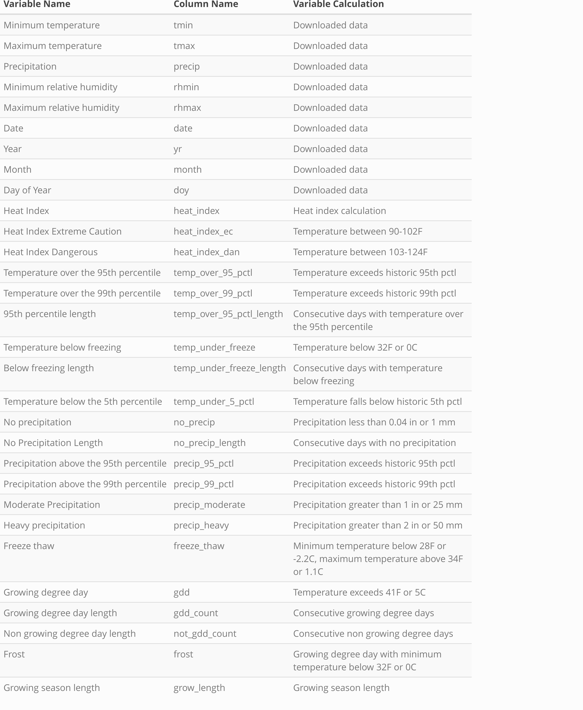

<!-- README.md is generated from README.Rmd. Please edit that file -->
<!-- badges: start -->
<!-- badges: end -->

# Reproducible Climate Futures (rcf)

## Overview

This package aims to make acquiring and working with [MACA
v2](http://www.climatologylab.org/maca.html) climate data faster and
easier and to provide a number of summary statistics that can be used to
visualize different climate futures. Ultimately, having access to this
data supports planning efforts that aim to incorporate climate change.

## Installation

Until approval on CRAN, you can download the development version of
`rcf`

You can install the released version of rcf from
[CRAN](https://CRAN.R-project.org) with:

``` r
install.packages("rcf")
```

And the development version from [GitHub](https://github.com/) with:

``` r
# install.packages("devtools")
devtools::install_github("nationalparkservice/rcf")
```

``` r
library(tidyverse)
#> -- Attaching packages --------------------------------------- tidyverse 1.3.1 --
#> v ggplot2 3.3.5     v purrr   0.3.4
#> v tibble  3.1.3     v dplyr   1.0.7
#> v tidyr   1.1.3     v stringr 1.4.0
#> v readr   2.0.1     v forcats 0.5.1
#> -- Conflicts ------------------------------------------ tidyverse_conflicts() --
#> x dplyr::filter() masks stats::filter()
#> x dplyr::lag()    masks stats::lag()
library(rcf)
```

## Usage

Download data using the `rcf_data()` function from the `rcfdata` package
to start visualizing climate futures

``` r
# devtools::install_github("nationalparkservice/rcfdata")
# library(rcfdata)
# raw_data <- rcf_data(SiteID = "BAND",
#                      latitude = 35.75758546,
#                      longitude = -106.3054344,
#                      units = "imperial")
```

``` r
raw_data <- read_csv("https://irmadev.nps.gov/DataStore/DownloadFile/660685")
#> Rows: 2191480 Columns: 10
#> -- Column specification --------------------------------------------------------
#> Delimiter: ","
#> chr  (2): gcm, units
#> dbl  (7): yr, precip, tmin, tmax, tavg, rhmin, rhmax
#> dttm (1): date
#> 
#> i Use `spec()` to retrieve the full column specification for this data.
#> i Specify the column types or set `show_col_types = FALSE` to quiet this message.
```

Calculate threshold values using `calc_thresholds()` and summarize them
by month, season or year as well as by quadrant or the most extreme
model in each quadrant using `cf_quadrant()`.

``` r
thresholds <- calc_thresholds("BAND", data = raw_data, units = "imperial")
#> Adding missing grouping variables: `gcm`
#> Warning in calc_thresholds("BAND", data = raw_data, units = "imperial"): Files
#> have been saved to temporary directory and will be deleted when this R session
#> is closed. To save locally, input a local directory in which to save files into
#> the `directory` argument.
#> Warning in calc_thresholds("BAND", data = raw_data, units = "imperial"):
#> thresholds.csv generated successfully. DO NOT edit this csv in excel. File is
#> too large and data will be lost, causing errors in future calculations.

quadrant_year <- cf_quadrant("BAND", data = thresholds, future_year = 2040, summarize_by = "year", method = "quadrant")
#> Warning in cf_quadrant("BAND", data = thresholds, future_year = 2040,
#> summarize_by = "year", : Files have been saved to temporary directory and
#> will be deleted when this R session is closed. To save locally, input a local
#> directory in which to save files into the `directory` argument.
```

From here we can use `ggplot2` to visualize any variables and how they
compare between the 4 climate futures as well as between past and
future.

``` r
quadrant_year_future <- quadrant_year %>%
filter(time %in% c("Future"))

ggplot(data = quadrant_year_future, aes(x = cf, y = freeze_thaw)) +
geom_boxplot(alpha = 0.4,
             aes(color = cf, fill = cf)) +
geom_jitter(alpha = 0.7,
            aes(color = cf, fill = cf)) +
scale_fill_viridis_d() +
scale_color_viridis_d() +
  labs(y = "Number of days per year",
       title = "Days that have a freeze thaw cycle by climate future") +
  theme(axis.title.x = element_blank()) +
  theme_minimal()
```


## Explore further

For a more in-depth explanation of the `rcf` package and different ways
to download the data, you can follow along with [An Introduction to the
Reproducible Climate Futures
package](https://github.com/Janelle88/rcf_addendum/blob/master/RCF%20instructions%20-%20simple.pdf).

## Data


