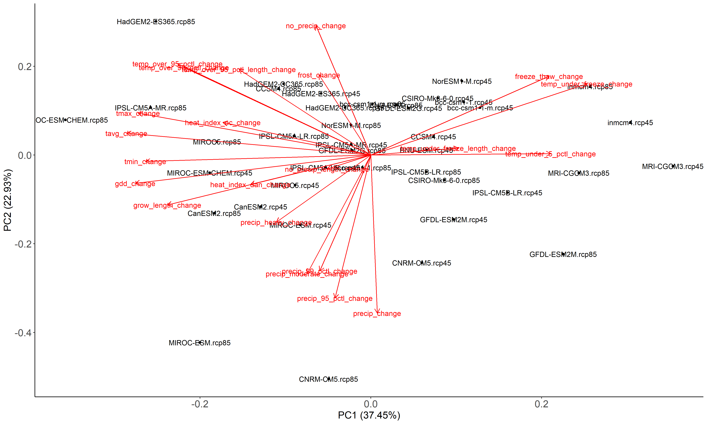

```{r, include = FALSE}
knitr::opts_chunk$set(
  collapse = TRUE,
  comment = "#>"
)
```

```{r setup, message = FALSE}
library(rcf)
library(dplyr)
library(readr)
library(here)
library(ggplot2)
library(ggrepel)

my_directory <- "~"
```
## What is PCA and why use it?

Principal components analysis (PCA) is a statistical tool that can help to visualize the variance of more than 2 variables. In traditional model selection methods, we select models using just temperature and precipitation, but PCA allows us use as many variables as we would like to select models that best represent the climate futures we are interested in. If we want to select which models will best show changes in temperature, precipitation, relative humidity, growing degree days and freeze thaw cycles, PCA is the best tool to use. It essentially is able to condense the variance of all 5 of those variables into an x-y plot, and we can select which models show the most variability on that plot. A more in-depth explanation of PCA can be found [here](https://royalsocietypublishing.org/doi/10.1098/rsta.2015.0202).

## PCA in the rcf package

For more advanced users of the `rcf` package, models can be selected using PCA with a somewhat adjusted workflow. You can either use your own data and start at the `cf_pca()` function, or you can use the threshold values to calculate which models are most representative of the variables you are interested in. 

If you would like to use your own data to calculate the PCA, you can skip down to the "PCA Calculation" section below.

If you want to use the data that is created from the threshold values, the first two steps in using PCA are exactly the same as using the quadrant method:

1. Download data using `rcf_data()`
2. Calculate threshold values using `calc_thresholds()`

To see how to do this, you can follow along with An Introduction to the Reproducible Climate Futures package(INSERT LINK).

```{r}
# raw_data <- rcf_data(SiteID = "BAND",
#                      latitude = 35.75758546,
#                      longitude = -106.3054344,
#                      directory = my_directory,
#                      units = "imperial")

raw_data <- read_csv("https://irmadev.nps.gov/DataStore/DownloadFile/660685")

thresholds <- calc_thresholds("BAND", data = raw_data, directory = my_directory, units = "imperial")
```


Once the first two steps are completed, we can move on to summarizing for PCA.

## 1. Summarize threshold values for PCA

The threshold data used for PCA are change values from past to future. Therefore, we calculate those values first, and can enter them into our `cf_pca()` function afterwards.

```{r}
pca_summary <- summarize_for_pca("BAND", data = thresholds, future_year = 2040, directory = my_directory)
```

We can look at the data to see how changes compare between models and what changes will happen in the future, averaged over 30 years.

```{r}
glimpse(pca_summary)
```


## 2. Calculate PCA

If you are using your own data, the only column that you need to have (other than the variables you are using for PCA) is a column labeled `gcm` with the GCMs you want to select from. Looking at more models will guarantee that you are selecting the models that are most representative of your chosen variables. As a reference, the MACA data that is used in this package has 20 models, each with RCPs 4.5 and 8.5, meaning that the PCA selects the 2 or 4 most representative models out of 40 options. It is important that the variables you are choosing match the column names of those variables, otherwise the function will throw an error.

If you are continuing from the workflow above, you can now choose which variables you are most interested in calculating your PCA from. There are two ways to choose variables from the threshold dataframe:

1. Select all threshold variables - If you want to look at all threshold variables, including temperature, precipitation and relative humidity, this function allows you to type in `"all_threshold"` into the `variables` argument to use all variables. 
2. Select your own variables - If you want to choose fewer variables, there is an explanation of each variable in the `README` on the [rcf landing page](https://github.com/nationalparkservice/rcf). To use these variables for PCA, the naming convention follows the naming convention in the "Column Name" column of the table in the "Data" section, with `_change` added to the end of the variable name. For example, if you want to look at growing season, precipitation and heat index dangerous, you would find that the column names for these variables are `grow_length`, `precip`, and `heat_index_dan` and you would enter `c("grow_length_change", "precip_change", "heat_index_dan_change")` into the `variables` argument. It is important that the variables you are choosing match the column names of those variables, otherwise the function will throw an error. 

Now that you understand how to use the function, let's see what we get from it!

```{r}
pca_means <- cf_pca("BAND", data = pca_summary, variables = "all_threshold", directory = my_directory)
```

This function returns a dataframe and an image of the PCA plot and a dataframe named "BAND_future_means_pca.csv" with the models that have been selected for PCA. Any columns that have non-numeric values or NAs will be removed, as R cannot calculate PCA on columns that contain NAs.

First, let's look at the dataframe.

```{r}
glimpse(pca_means)
```

And the PCA plot.

```{r, echo=FALSE, out.width = "110%", fig.align='center'}

```

This plot shows that 37.45% of the variance between all of these variables is represented by PC1 and 22.95% of the variance between these variables is represented by PC2. This indicates that these two components represent approximately 60% of the variance amongst all of these models.

Now that we have selected our models, we can go on to summarize the thresholds by PCA models using the `pca_thresholds()` function.

## 3. Summarize thresholds using PCA models

This function allows you to summarize your variables by month, season or year as well. You will need to enter two dataframes into this function:

1. `pca_data` is the resultant data from the `cf_pca()` function
2. `all_data` is the resultant data from the `calc_thresholds()` function

This function is only for the thresholds data that this package calculates. You can choose to select PCA models using whichever variables you want (including variables that are not included in the thresholds) and still be able to summarize threshold variables from the `calc_thresholds()` function by the selected PCA models. You cannot however, summarize a dataset that does not include all threshold variables, i.e. a dataset that has been modified after using the `calc_thresholds()` function.

```{r}
threshold_summary <- pca_thresholds("BAND", pca_data = pca_means, all_data = thresholds, summarize_by = "year", directory = my_directory)
```

Now, let's look at the summary data:

```{r}
glimpse(threshold_summary)
```

## 4. Graphing

Because this is a dataframe, we can plot any of these variables using ggplot.

Let's look at the same graphs we looked at in An Introduction to the Reproducible Climate Futures package(INSERT LINK)

How does the precipitation change over time in the 4 climate futures?

```{r, fig.width=15, fig.height=9, out.width="110%"}
ggplot(data = threshold_summary, aes(x = time, y = precip_yearly)) +
  geom_boxplot(aes(color = time,
                   fill = time),
               alpha = 0.2) +
  geom_jitter(aes(color = time),
              size = 2.5,
              alpha =.6) +
  facet_wrap(~pca_type) +
  scale_color_manual(values = c("#8386CC", "#12045C")) +
  scale_fill_manual(values = c("#8386CC", "#12045C")) +
  labs(y = "Yearly Precipitation (in)",
       title = "Yearly precipitation for individual GCMs representative of 4 climate futures") +
  theme_minimal() +
  theme(text = element_text(size = 20),
        legend.title = element_blank(),
        axis.title.x = element_blank())
```

How do number of days that exceed the historical 99th percentile of heat compare in the past and future?

```{r, fig.width=15, fig.height=9, out.width="110%"}
ggplot(data = threshold_summary, aes(x = time, y = temp_over_99_pctl)) +
  geom_boxplot(aes(color = time,
                   fill = time),
               alpha = 0.2) +
  geom_jitter(aes(color = time),
              size = 2.5,
              alpha =.6) +
  facet_wrap(~pca_type) +
  scale_color_manual(values = c("darksalmon", "#E10720")) +
  scale_fill_manual(values = c("darksalmon", "#E10720")) +
  labs(y = "Number of days per year",
       title = "Days where temperature exceeds the 99th percentile for\n individual GCMs representative of 4 climate futures") +
  theme_minimal() +
  theme(text = element_text(size = 20),
        legend.title = element_blank(),
        axis.title.x = element_blank(),
        plot.title = element_text(hjust = 0.5))
```

What about the growing season length between models? How does that compare between the four climate futures?

```{r, fig.width=15, fig.height=9, out.width="110%", warning=FALSE}
threshold_summary_future <- threshold_summary %>%
filter(time %in% c("Future"))

ggplot(data = threshold_summary_future, aes(x = time, y = grow_length)) +
  geom_boxplot(aes(color = pca_type,
                   fill = pca_type),
               alpha = 0.2) +
  geom_jitter(aes(color = pca_type),
              size = 2.5,
              alpha =.6) +
  facet_wrap(~pca_type) +
  scale_color_manual(values = c("#8FD834", "#72CC50", "#019875", "#00AEAD")) +
  scale_fill_manual(values = c("#8FD834", "#72CC50", "#019875", "#00AEAD")) +
  labs(y = "Length of growing season",
       title = "Growing season length for individual GCMs representative of 4 climate futures") +
  theme_minimal() +
  theme(text = element_text(size = 20),
        legend.title = element_blank(),
        axis.title.x = element_blank(),
        plot.title = element_text(hjust = 0.5))
```
